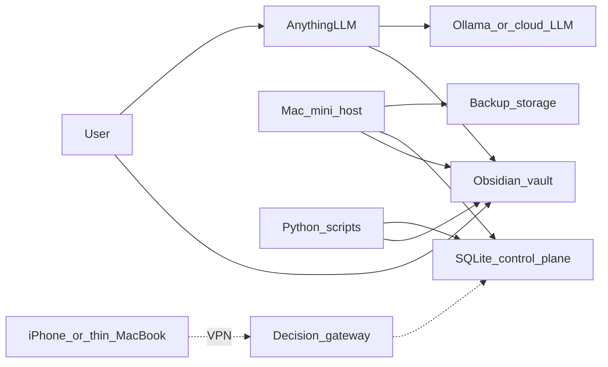
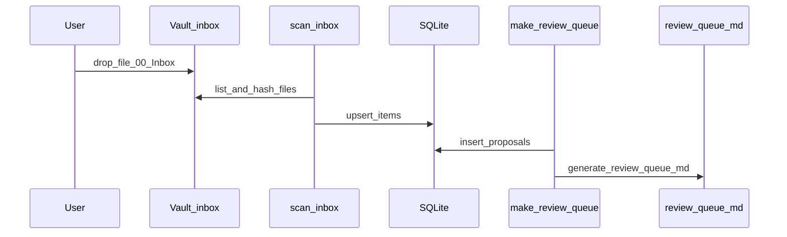
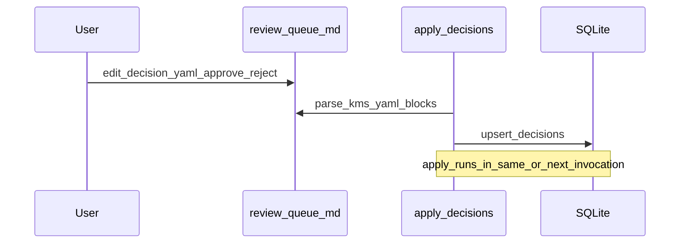
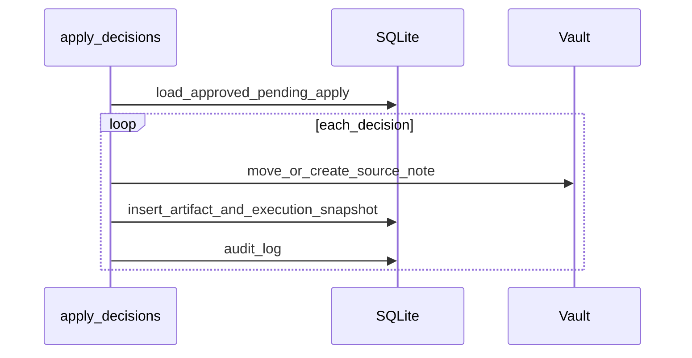
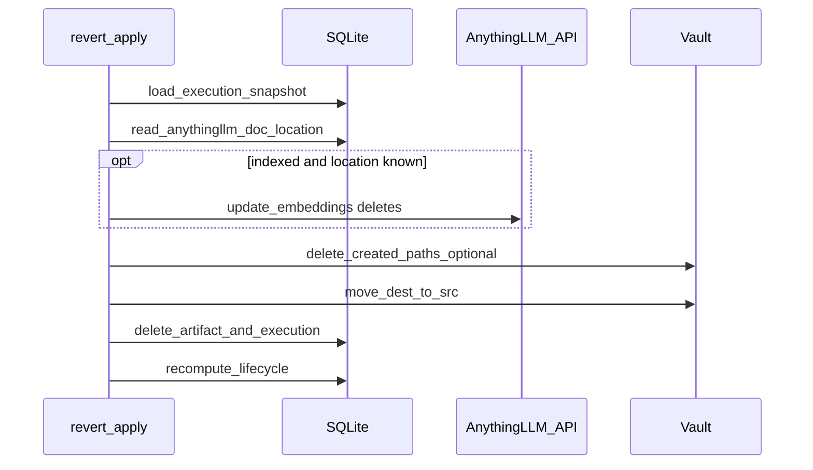

# Architektura: Local-first KMS z human-in-the-loop control plane

## Spis treści

1. [Cel](#1-cel)
2. [Non-goals](#2-non-goals--out-of-scope)
3. [Komponenty](#3-komponenty)
4. [Source of truth](#4-source-of-truth)
5. [Model danych](#5-model-danych-minimalny)
6. [Diagram kontekstowy](#6-diagram-kontekstowy)
7. [Diagramy sekwencji](#7-diagramy-sekwencji)
8. [Failure model](#8-failure-model)
9. [Definition of Done (systemowe)](#9-definition-of-done-systemowe)
10. [Ryzyka](#10-ryzyka)
11. [Atrybuty jakości](#11-atrybuty-jakości)
12. [Roadmap / milestone’y](#12-roadmap--milestones)
13. [Future readiness: knowledge continuity](#13-future-readiness-knowledge-continuity)

---

## 1. Cel

**Problem:** Rozwiązania typu „chat with your docs” dobrze odpowiadają na pytania, ale słabo rozwiązują problem operacyjny: co zrobić z nowym źródłem, jak utrzymać porządek w korpusie, jak rozróżnić sugestię od wykonanej operacji oraz jak zachować audyt i przewidywalność. Sam retrieval to za mało — potrzebny jest cienki **control plane**.

**Cel systemowy:** Zaprojektować mały, **local-first** system operacji na wiedzy, który:

- wykorzystuje gotowe narzędzia AI do retrievalu i pracy z dokumentami;
- rozdziela **content plane** (treść w vaultcie) od **decision plane** (stan, propozycje, decyzje w SQLite);
- utrzymuje człowieka jako centrum decyzyjne (**human-in-the-loop**);
- jest **audytowalny**, **idempotentny** i prosty operacyjnie;
- daje się uruchomić lokalnie na jednym hoście;
- może być później rozszerzony o cienki **gateway** wyłącznie do decyzji (bez wystawiania całego stacku).

**Pozycjonowanie (jedno zdanie):** *Local-first system operacji na wiedzy, w którym gotowe narzędzia robią retrieval, a cienki control plane pilnuje decyzji, statusów i zmian — z człowiekiem w pętli.*

---

## 2. Non-goals / Out of scope

Na bieżącym etapie **świadomie nie budujemy**:

| Poza zakresem | Uwaga |
|---------------|--------|
| Własna baza wektorowa / własny RAG | Używamy AnythingLLM (lub podobnego) do retrievalu |
| Własny pipeline chunkingu i embeddingów | — |
| Autonomiczny agent mutujący wiedzę bez zatwierdzenia | Decyzje wymagają człowieka |
| Ciężki orchestrator (np. Airflow) | Automatyka: cron / systemd |
| Publiczne wystawianie całego stacku do internetu | Później ewentualnie tylko lekki gateway przez VPN |
| Rozbudowany panel administracyjny poza Obsidian | Review w markdown + plugin Obsidian (patrz §3) |
| Własny OCR stack od zera | — |
| Automatyczny merge notatek | — (sugestie merge w ``inbox_merge_advisor`` to tylko tekst dla reviewera + opcjonalny chat w AnythingLLM; **brak** mutacji vaultu bez `apply_decisions`) |

---

## 3. Komponenty

| Warstwa | Element | Rola |
|---------|---------|------|
| **Content plane** | Obsidian vault | Źródła, source notes, permanent notes, projekty, pliki review |
| **Content plane** | AnythingLLM | Retrieval i Q&A nad dokumentami (workspace’y) |
| **Content plane** | Ollama lub provider chmurowy | LLM / embeddingi (konfiguracja użytkownika) |
| **Decision plane** | SQLite (`state.db`) | Itemy, propozycje, decyzje, artefakty, audyt |
| **Decision plane** | Skrypty Python (`kms`) | Skan inboxu, kolejka review, apply, raporty |
| **Review UI** | `00_Admin/review-queue.md` | Źródło decyzji (format YAML w markdown) |
| **Obsidian plugin** | `kms-review` | Interaktywny interfejs: review, search, dashboard, revert, bulk ops — wywołuje skrypty Python |
| **Execution host** | Mac mini (docelowo) | Mutacje plików, apply, backup |
| **Gateway** | Thin client + gateway | Zdalne approve/reject/postpone przez VPN (zrealizowane — patrz `docs/gateway.md`) |

---

## 4. Source of truth

| Dane | Source of truth |
|------|-----------------|
| Treść wiedzy, notatki, ścieżki plików | **Vault** (Obsidian) |
| Workflow: kolejka, propozycje, decyzje, historia operacji | **SQLite** |

**Nie są source of truth** (artefakty robocze narzędzi):

- storage AnythingLLM, `.smart-env`, cache embeddingów, cache OCR, modele w `OLLAMA_MODELS`.

---

## 5. Model danych (minimalny)

### 5.1 Frontmatter source note (minimalny)

Zdefiniowany w szablonie; pola m.in.: `id`, `type`, `source_type`, `title`, `source_url`, `file_link`, `captured_at`, `language`, `topics`, `status`, `project`, `confidence`.

### 5.2 Statusy treści (konwencja ręczna)

`inbox` → `reviewed` → `active` → `archived` (minimalny zestaw).

**Uwaga:** Przejścia między statusami treści (frontmatter `status`) są **konwencją ręczną** — użytkownik aktualizuje pole w notatce. Control plane (`items.status`) śledzi stan operacyjny pliku (`new` / `pending` / `applied` / `failed`), nie status merytoryczny treści. Automatyczna promocja (np. `inbox → reviewed` po review) jest świadomie odłożona na rzecz prostoty.

### 5.3 Statusy operacji (item / pipeline)

`items.status` (plik): m.in. `new`, `pending`, `applied`, `failed`.

**Lifecycle propozycji** (`proposals.lifecycle_status`, cache wyliczany przez `kms.app.lifecycle.recompute_lifecycle`):

| Wartość | Znaczenie |
|---------|-----------|
| `awaiting_decision` | Decyzja w `decisions` = `pending` lub brak wiersza |
| `approved` | `approve`, brak jeszcze artefaktu (apply do wykonania) |
| `rejected` / `postponed` | Odrzucone / odłożone |
| `apply_failed` | `approve`, apply się nie udał (`items.status` = `failed`) |
| `applied` | Artefakt zapisany, indeks AnythingLLM jeszcze nie `ok` |
| `indexed` | `artifacts.index_status` = `ok` (lub legacy: `workspace_name` ustawione przy `pending`) |
| `index_failed` | Upload/embed AnythingLLM nie powiódł się — retry przez `sync_to_anythingllm` |

### 5.4 SQLite (control plane)

Tabele: `items`, `proposals`, `decisions`, `artifacts`, `executions` (snapshot pod revert), `audit_log`. Szczegóły: [`kms/app/schema.sql`](../kms/app/schema.sql).

- **`executions`**: jeden wiersz na udany apply — `snapshot_json` (ruch plików + utworzone ścieżki), używany przez `revert_apply`.
- **`artifacts.index_status`**: `pending` | `ok` | `failed` — indeksacja zewnętrzna (AnythingLLM), niezależnie od samego przeniesienia pliku.

---

## 6. Diagram kontekstowy

---

## 7. Diagramy sekwencji

### 7.1 Ingest nowego źródła

### 7.2 Review i approve

### 7.3 Apply decyzji (idempotentny)

### 7.4 Revert apply

**AnythingLLM:** przy `index_status = ok` i zapisanym `artifacts.anythingllm_doc_location` wywoływane jest `update-embeddings` z `deletes` (best-effort). Gdy brak `location` (stary sync) lub błąd API — audyt wskazuje ręczną korektę w UI.

---

## 8. Failure model

| Sytuacja | Zachowanie |
|----------|------------|
| Brak pliku źródłowego | Oznaczenie `failed`, audyt z komunikatem; pozostałe itemy bez zmian |
| Uszkodzony YAML w review-queue | Ostrzeżenie / skip bloku; nie mutuj vaultu dla tego bloku |
| Kolizja ścieżki docelowej | `failed` + audyt; brak nadpisywania bez jawnej decyzji |
| Ponowne uruchomienie apply | Idempotencja: już `applied` → skip |
| Błąd zapisu SQLite | Transakcje tam gdzie możliwe; audyt ostatniego błędu |
| Częściowe wykonanie | Itemy niezakończone pozostają `approved` lub `failed` z jawnym statusem |
| Apply OK, indeks AnythingLLM FAIL | `artifacts.index_status` = `failed`; pliki w vaultcie bez zmian; retry `sync_to_anythingllm` |
| Apply OK, sync OK | `index_status` = `ok`, `workspace_name` ustawione |
| Ponowny sync | Wiersze z `index_status` ∈ `pending`, `failed` są ponawiane; `ok` jest pomijany |
| Revert po indeksie OK | Najpierw API `deletes` (gdy jest `anythingllm_doc_location`); potem ruch plików; przy braku location / błędzie API — audyt + ewent. UI |

---

## 9. Definition of Done (systemowe)

Dla **każdego skryptu mutującego**:

- zapis do **audit_log** przy istotnych operacjach;
- **idempotencja** tam, gdzie dotyczy (zwłaszcza `apply_decisions`);
- obsługa **`--dry-run`** (gdzie dotyczy);
- czytelne **logi** (wejście, wynik, błędy);
- test na **błędne dane wejściowe** (smoke / unit).

Dla **review flow**: każda propozycja ma `reason`; decyzja ma status; rozróżnienie `pending` / `approved` / `applied` / `failed`.

Dla **backupu**: vault + SQLite; non-interactive; log wyniku lub błędu.

---

## 10. Ryzyka

| Ryzyko | Mitygacja |
|--------|-----------|
| Scope creep control plane | Twarda lista non-goals; tylko tabele i skrypty z planu |
| Coupling do AnythingLLM | Vault pozostaje SoT; narzędzie wymienne w dokumentacji |
| Niespójność vault ↔ SQLite | Hash ścieżek; audyt; backup obu |
| Zbyt wczesny gateway | ~~Etap osobny~~ → zrealizowany (Etap 6); apply nadal na hoście, gateway tylko decyzje |

---

## 11. Atrybuty jakości

**Priorytetowe:** prostota, przewidywalność, audytowalność, idempotencja, human-in-the-loop, local-first, łatwość demo, replikowalność na typowym laptopie (16–24 GB RAM).

**Drugorzędne:** maksymalna automatyzacja, mobilność od dnia pierwszego, najwyższa wydajność, bogaty UI.

---

## 12. Roadmap / milestones

| Etap | Nazwa | Wynik | Status |
|------|--------|--------|--------|
| 0 | Decyzje i granice | Ten dokument + ADR | **Done** |
| 1 | MVP workflow | Vault, skrypty: source note, daily report, backup | **Done** |
| 2 | Control plane | SQLite, scan, review queue, apply, audyt | **Done** |
| 3 | Stabilizacja | config, dry-run, logi, backup DB, testy, CI | **Done** |
| 4 | Demo / narracja | Przykładowe pytania, scenariusz prezentacji | **Done** |
| 5 | Starter kit | README, docker-compose, Dockerfile, setup, profile local/cloud | **Done** |
| 6 | Gateway | Lekki interfejs decyzji + VPN (patrz `docs/gateway.md`) | **Done** (ADR-005 superseded) |
| 7 | Plugin Obsidian | Plugin kms-review: review UI, search, dashboard, bulk ops, revert | **Done** |
| 8 | Product polish | i18n, settings, onboarding, dark mode, accessibility | W trakcie |
| 9 | Knowledge continuity | Rozszerzalne typy notatek, ownership — patrz sekcja 13 | Fundament ready; pełna realizacja przyszła |

**Kolejność:** manualny pipeline → control plane → stabilizacja → packaging → gateway → plugin → polish → continuity layer.

**Stan na 2026-04-06:** Etapy 0–7 zrealizowane. Etap 8 (product polish) w trakcie. Etap 9 (continuity beyond templates) świadomie odłożony.

---

## 13. Future readiness: knowledge continuity

Celem późniejszego etapu jest **ciągłość wiedzy** (np. przy odejściu ekspertów), **bez** budowania teraz pełnego enterprise KMS.

**Fundament pod przyszłość (już teraz):**

- rozszerzalny **`type`** w frontmatterze (np. `source-note`, później `decision-note`, `risk-note`, `expert-interview`);
- pola metadata zarezerwowane w szablonach: `owner`, `reviewer`, `domain`, `last_reviewed_at`, `sensitivity` (mogą być puste);
- **ten sam** model review queue i SQLite — nowe typy spraw to nowe `kind` / propozycje, nie nowy silnik.

**Świadomie nie teraz:** pełna ontologia organizacji, knowledge graph, automatyczny merge notatek, ciężkie workflow dla całej firmy.

Szczegóły: [`docs/continuity.md`](continuity.md).

---

## Format pliku `review-queue.md` (kontrakt)

Każda propozycja jest blokiem fenced YAML między markerami `<!-- kms:begin -->` i `<!-- kms:end -->` (patrz wygenerowany plik). Pola m.in.: `proposal_id`, `decision` (`pending` \| `approve` \| `reject` \| `postpone`), `reviewer`. Parser ignoruje resztę markdownu.

---

## Powiązane dokumenty

- [Skrót decyzji (Etap 0)](architecture-decisions.md)
- [ADR — indeks](adr/README.md)
- [Workflow użytkownika](workflow.md)
- [CLI i konfiguracja](cli.md)
- [Demo konferencyjne](conference-demo.md)
- [Gateway (faza późna)](gateway.md)
- [Continuity](continuity.md)
